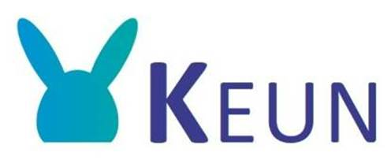

# 

**Keun** ([West-Vlaams](https://en.wikipedia.org/wiki/West_Flemish) voor [konijn](https://anw-ivdnt-org.translate.goog/article/keun?_x_tr_sl=nl&_x_tr_tl=en&_x_tr_hl=nl&_x_tr_pto=wapp)) Een webgebaseerde moderne variant van de [Usagi](https://www.ohdsi.org/web/wiki/doku.php?id=documentation:software:usagi) OMOP [CDM](https://www.ohdsi.org/data-standardization/) mapping tool.

# Installatie

Om gebruik te maken van Keun volg de handleiding die [hier](https://github.com/RADar-AZDelta/Keun?tab=readme-ov-file#setup) terug te vinden is.

# Gebruik

Bekijk de mogelijke functionaliteiten [hier](https://github.com/RADar-AZDelta/Keun?tab=readme-ov-file#usage). 

# Oefening

Om het mappen van concepten in Keun uit te testen, kun je de volgende bestanden uploaden:

1. **Mapping Person tabel**
   - Schrijf de Usagi-query en exporteer de resultaten uit BigQuery.
   - Laad het CSV-bestand in Keun.
   - Map de concepten met betrekking tot geslacht.
   - Download het resultaat.

2. **Mapping Metingen tabel**
   - Importeer de volgende CSV-bestanden in Keun:
       - [Metingen uit vragenlijsten](https://github.com/RADar-AZDelta/OMOP-workshop/blob/main/workshop_input/OMOP_CDM/measurement/measurement_concept_id/questionnaires.csv)
       - [Metingen uit metingentabel](https://github.com/RADar-AZDelta/OMOP-workshop/blob/main/workshop_input/OMOP_CDM/measurement/measurement_concept_id/measurements.csv)
   - Map de verschillende concepten en download de resultaten.

3. **Mapping Drug tabel**
   - Importeer het volgende CSV-bestand in Keun:
       - [Drug](https://github.com/RADar-AZDelta/OMOP-workshop/blob/main/workshop_input/OMOP_CDM/drug_exposure/drug_concept_id/medication.csv)
   - Map de verschillende concepten en download de resultaten.
  
4. **Mapping Observatie tabel**
   - Importeer de volgende CSV-bestanden in Keun:
       - [Observaties uit vragenlijsten](https://github.com/RADar-AZDelta/OMOP-workshop/blob/main/workshop_input/OMOP_CDM/observation/observation_concept_id/questionnaires.csv)
   - Map de verschillende concepten en download de resultaten.
