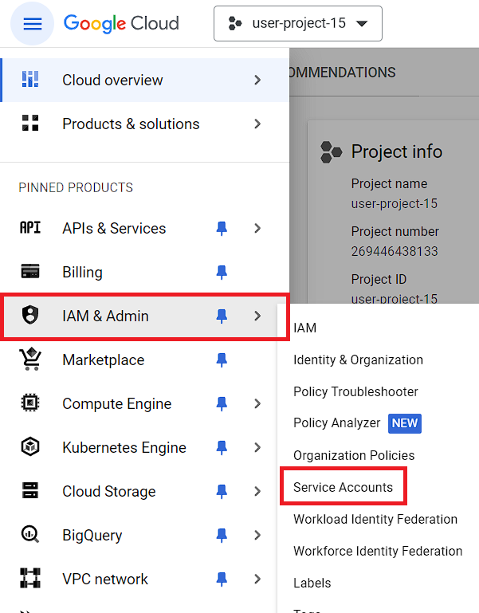
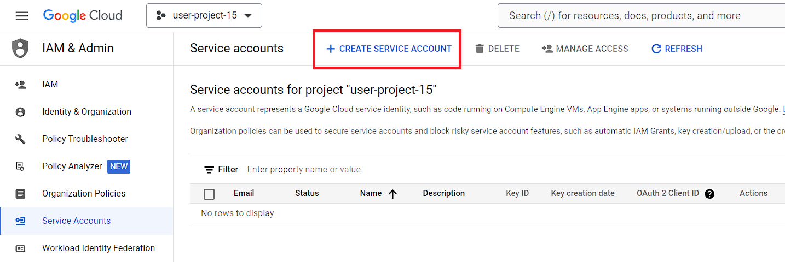
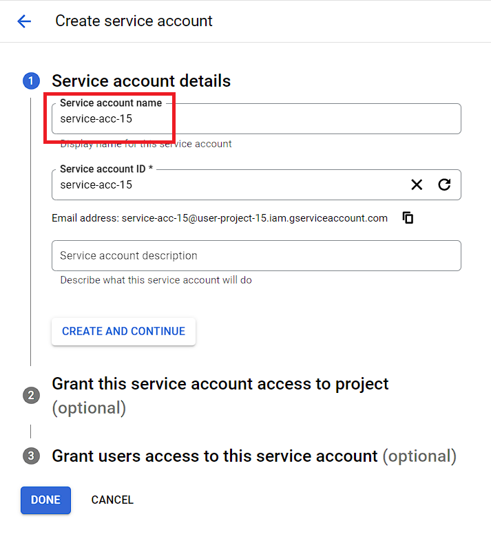
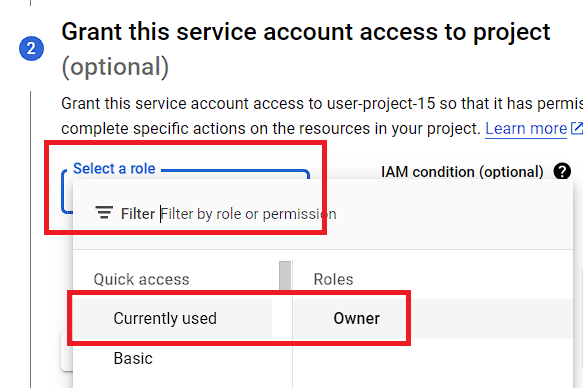
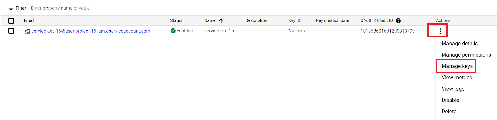
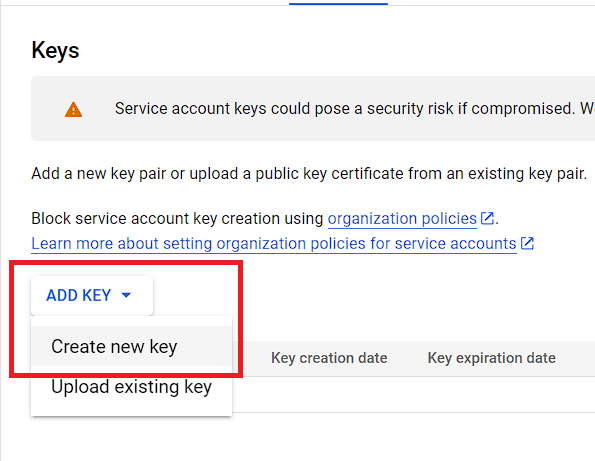
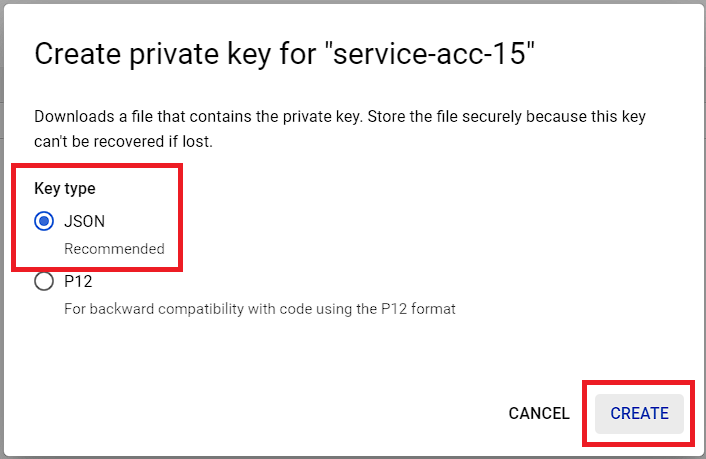

# OMOP-workshop

## Inhoudstabel

* [Installatie](#installatie)
* [Service Account aanmaken](#service-account)
* [Bucket backup bij problemen](#bij-problemen-met-de-cloud-storage)

## Installatie

Ga naar je Google Cloud-account en log in. Controleer vervolgens of het project waarin je gaat werken correct is ingesteld. Het project moet je gebruikersnummer bevatten.


Open de Cloud Shell en zodra deze is geladen, voer dan het volgende commando uit:

```bash
    gsutil cp gs://summer-school-bucket/workshop_input/configure_big_query.py - | python
```
**Let op:** in dit commando moet je nog je gebruikersnummer aanpassen.

Dit commando zal BigQuery configureren met de benodigde datasets en in de 'raw_data'-dataset tabellen aanmaken met de vereiste gegevens.

De Cloud Shell kun je terugvinden rechts in je navigatiebalk:


Eenmaal dit gelukt is, moet je naar de pagina met buckets navigeren op een van de volgende manieren:


of


Ga naar de `summer-school-bucket` met jouw gebruikersnummer. De bucket bevat het volgende:

- De map **raw_data** bevat alle gegevens die aanvankelijk zijn geladen in BigQuery.
- De map **workshop_input** bevat alle bestanden die je nodig zult hebben.

Download de map workshop_input. Plaats deze naar keuze op je apparaat.


Als volgende stap zetten we de `riab.ini` klaar. Dit configuratiebestand maakt het mogelijk om lokaal op ons apparaat te werken met Rabbit in a Blender en tegelijkertijd de gegevens aan te passen in onze BigQuery.

```ini
[riab]
db_engine=bigquery

[bigquery]
credentials_file={credentials_file}.json
; The credentials file must be a service account key, stored authorized user credentials, external account credentials, or impersonated service account credentials. (see https://google-auth.readthedocs.io/en/master/reference/google.auth.html#google.auth.load_credentials_from_file)
; Alternatively, you can also use 'Application Default Credentials' (ADC) (see https://cloud.google.com/sdk/gcloud/reference/auth/application-default/login)
location=europe-west1
; Location where to run the BigQuery jobs. Must match the location of the datasets used in the query. (important for GDPR)
project_raw={project_id}
; Can be handy if you use jinja templates for your ETL queries (ex if you are using development-staging-production environments). Must have the following format: PROJECT_ID
dataset_work={project_id}.work
; The dataset that will hold RiaB's housekeeping tables. Must have the following format: PROJECT_ID.DATASET_ID
dataset_omop={project_id}.omop
; The dataset that will hold the OMOP tables. Must have the following format: PROJECT_ID.DATASET_ID
dataset_dqd={project_id}.dqd
; The dataset that will hold the data quality tables. Must have the following format: PROJECT_ID.DATASET_ID
dataset_achilles={project_id}.achilles
; The dataset that will hold the data achilles tables. Must have the following format: PROJECT_ID.DATASET_ID
bucket=gs://summer-school-bucket-{user_number}/upload
; The Cloud Storage bucket uri, that will hold the uploaded Usagi and custom concept files. (the uri has format 'gs://{bucket_name}/{bucket_path}') 
```

Hier moeten de volgende dingen worden aangepast:

- **credentials_file**: Dit moet de naam zijn van de service key, het JSON-bestand dat te vinden is in de workshop_input-map die je hebt gedownload.
- **project_id**: Dit is het project-ID van het Google Cloud Project waarin je werkt. Je kunt dit vinden door op je project te klikken in de navigatiebalk. Er verschijnt een pop-up waarin je zowel de naam als het ID van het project zult zien.
- **user_number**: Dit is het nummer van het account dat je gebruikt. Je kunt dit vinden in het e-mailadres of in de naam van het Google Cloud Project.

Dit kun je handmatig invullen of je kunt gebruiken maken van de script `configure_ini.py`. In deze script kun je de nodige zaken aanvullen en de script uitvoeren in een terminal met de volgende command:

```bash
    python configure_ini.py
```
**Let op**: Om dit script te laten werken moeten de script en de riab.ini file op hetzelfde path liggen.

Zorg er als volgende stap voor dat je [Python versie 3.12](https://www.python.org/downloads/release/python-3120/) op je apparaat hebt geïnstalleerd. Je kunt de huidige versie die op je apparaat wordt gebruikt controleren door het volgende commando in een terminal in te voeren:

```bash
    python --version
```

Als de Python-versie correct is ingesteld, moet je de Python-package van Rabbit in a Blender installeren met het volgende commando:

```bash
    pip install Rabbit-in-a-Blender
```

Controleer of dit correct is gelukt door het volgende commando uit te voeren in je terminal:

```bash
    riab --version
```

## Service Account

Een service account is uniek per account en hangt vast aan het account a.d.h.v. het emailadres. - [Google documentatie](https://cloud.google.com/iam/docs/service-account-overview)

**DISCLAIMER**: deze stap hoeft enkel worden uitgevoerd, indien iedere workshop deelnemer een eigen account toegewezen krijgt. 

### Stap 1: AIM & Admin => Service Accounts

<div align="left">
    
</div>

### Stap 2: + create service account

<div align="left">
    
</div>

### Stap 3: naamgeving

Vul enkel het eerst veld in. 
Daarna **'Create and Continue'**

<div align="left">
    
</div>

### Stap 4: toegang en gepaste rolgeving

Het service account heeft de gepaste rechten nodig om acties uit te voeren. 
Geef daarom in dit geval uitzonderlijk hier de rechten van **'Owner'** aan.

<div align="left">
    
</div>

### Stap 5: voeg keys toe

Na het creeëren van het service account zul je hier op terechtkomen. 
Dit is zichtbaar onder **Service Accounts**.

<div align="left">
    
</div>

### Stap 6: ADD KEY en Create new key. 

Volg de stappen. 

<div align="left">
    
</div>

### Stap 7: JSON as key type => Create

Volg de stappen in de foto. Wanneer je op **CREATE** klikt, zal er een .json bestand gedownload worden. Verwijder dit niet. 

<div align="left">
    
</div>
---

Het service account is nu toegevoegd. Vraag verdere instructies voor het geval dat het gedownloade bestand moet toegevoegd worden aan een Cloud Storage (bucket).

## Bij problemen met de Cloud Storage. 

Open de Cloud Shell.


Voer het volgende commando uit:

```bash
    python backupScript.py
```


Dit zorgt ervoor dat je script correct wordt uitgevoerd.


refresh het overzicht van de buckets:


Nu zul je een nieuwe bucket zien met de bestanden die je nodig hebt om verder te gaan met de workshop.


